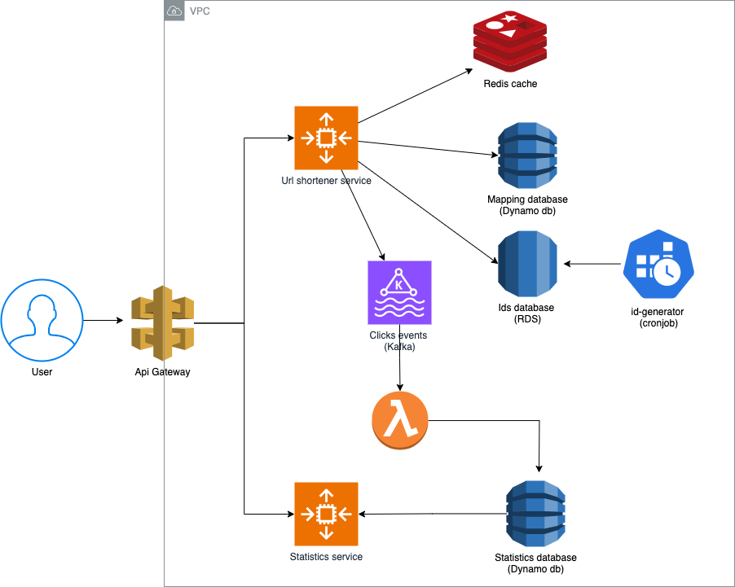
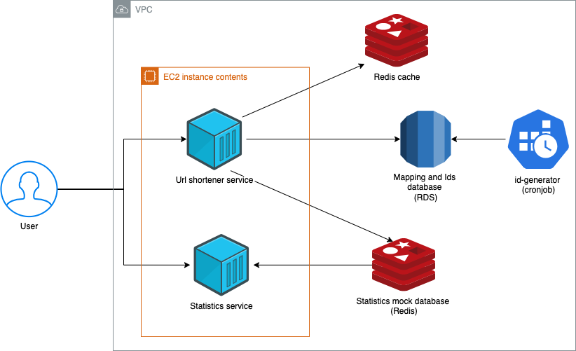

# MELI URL Shortener Challenge

## Table of Contents

- [Overview](#overview)
- [Requirements](#requirements)
- [Analysis](#analysis)
- [Architecture](#architecture)
- [Technology Stack](#technology-stack)
- [API Endpoints](#api-endpoints)
- [Demo](#demo)

## Overview

This project delivers an efficient, scalable URL shortening solution tailored for sharing promotions on social media
platforms, such as Twitter. The service is designed to handle high traffic, support URL management, and provide near
real-time access statistics.

## Requirements

- **Indefinite Validity**: URLs must remain active indefinitely, with no expiration.
- **High Traffic Capacity**: Support up to 1 million requests per minute (RPM).
- **Near Real-Time Statistics**: Provide analytics on URL access as close to real-time as possible.
- **Manageable URLs**:
    - Enable or disable specific URLs.
    - Modify destination URLs as needed.
- **Fast Resolution**: Ensure rapid URL resolution for optimal user experience.
- **High Uptime**: Maintain a target uptime of 99.98%.

## Analysis

To meet these requirements, the system must be designed with scalability, reliability, and performance as core
principles. Key considerations include:

- **Traffic Load**: The architecture should support high concurrency and low latency. A microservices approach and
  caching mechanisms will help achieve this.
- **Data Storage**: Choosing an appropriate database is essential for maintaining performance and manageability.
- **URL Resolution**: The system’s focus should prioritize URL resolution, given the high traffic expected from social
  media interactions.

### ID Generation

Our short URLs are intended to have indefinite validity. To estimate the number of unique IDs required, we assume a peak
load of 1 million requests per minute, resulting in approximately **525.6 billion requests per year**.

Given the nature of this system, the majority of these requests will be redirections (clicks on short URLs) rather than
URL creations. Based on this, we estimate the following distribution over a given time interval:

- **94.5% Redirections**: Due to social media sharing, the volume of redirections will be significantly high.
- **0.5% URL Creations**: The rate of creation requests will be relatively low compared to redirections.
- **5% Statistics Requests**: With real-time analytics, the frequency of statistics requests will be slightly higher
  than creation requests.
- **0.5% Modifications**: Assuming each URL is modified at least once on average.

Based on this distribution, for one year of requests (525.6 billion), we would need approximately **2.628 billion unique
IDs**. For practicality, we assume "indefinite validity" as 100 years, leading to a total requirement of **262.8 billion
unique IDs** over that period.

With standard Base62 encoding (letters in uppercase and lowercase plus numbers), a 7-character ID will provide more than
enough unique combinations:

- **6 Characters**: 62^6 = 56 billion unique values (insufficient).
- **7 Characters**: 62^7 = 3.5 trillion unique values (sufficient).

We’ll generate sequential numbers and convert them to Base62 for simplicity, as we do not have confidentiality
restrictions on the IDs.

To optimize the URL shortening process, IDs will be pre-generated in periodic batches and stored in a database, ready
for use by the URL shortener service as needed.

### Data Storage

The schema for mapping short URLs to long URLs could be structured as follows:

- **shortUrl**: The unique ID generated to retrieve the long URL (7 characters, approximately 7 bytes).
- **longUrl**: The destination URL. URLs for promotions are often lengthy due to parameters and additional information.
  Assuming an average length of 400 characters (~400 bytes).
- **userId**: Identifier for the user who created the mapping, required for modifications (28 characters, ~28 bytes).
- **active**: Indicates if the URL is currently active (true) or disabled (false) (1 byte).

**Total per mapping**: ~450 bytes. Given an estimate of 262.8 billion mappings over 100 years, the total storage
requirement is approximately **108 terabytes**.

The schema for storing click statistics would include:

- **shortUrl**: The clicked short URL ID, used as a key in a key-value store (7 bytes).
- **clickCounts**: The total number of clicks for each short URL (8 bytes).

**Total per statistic entry**: 15 bytes.

### Requirements Review

- **Indefinite Validity**:
    - We plan for a minimum of 100 years of URL validity to meet this requirement.

- **High Traffic Support** (1 million requests per minute):
    - Achieved through horizontal scaling, caching mechanisms, and pre-generated IDs for faster lookups.

- **Near Real-Time Statistics**:
    - Real-time analytics are supported by a Kafka queue for statistics events, with a consumer Lambda function that
      saves results in the statistics database.

- **Manageable URLs**:
    - User-specific endpoints allow the creator to modify mappings, with `userId` serving as an identifier.

- **Fast Resolution**:
    - Caching and pre-generated IDs ensure quick URL resolution.

- **High Uptime** (99.98% target):
    - Autoscaling and an API Gateway with load balancing contribute to consistent uptime.

## Architecture

The proposed design comprises multiple components optimized for performance, scalability, and real-time analytics. Each
component fulfills specific functional requirements:

1. **API Gateway**: Serves as the main entry point, providing load balancing, request routing, and security features
   like rate limiting to manage high traffic volumes effectively.

2. **URL Shortener Service (Golang)**: The core service responsible for creating, retrieving, and managing short URLs.
   It handles URL encoding and decoding, designed for high concurrency to support massive requests per minute.

3. **DynamoDB (URL Mappings)**: A managed NoSQL database for storing URL mappings (short URL to long URL), offering
   high-speed read/write operations, horizontal scalability, and minimal maintenance, making it ideal for high-traffic
   demands.

4. **Cache Layer (Redis)**: Caches frequently accessed URLs, significantly improving retrieval speed and reducing the
   load on DynamoDB. Redis’s flexible data types enable efficient caching and quick response times.

5. **RDS (ID Database)**: A SQL database dedicated to managing unique ID generation, ensuring each ID is assigned
   uniquely to requests with ACID compliance.

6. **ID Generator (Golang)**: A scheduled process that periodically generates and stores new unique IDs in the ID
   database, ready for URL shortening requests.

7. **Analytics Service**: Collects and processes click events and usage metrics in real time. Kafka streams events to
   AWS Lambda, where metrics are aggregated and stored in DynamoDB for analytics.

8. **DynamoDB (Statistics)**: A separate DynamoDB instance for storing real-time analytics data, optimized for fast read
   and write access to meet real-time performance demands.



## Technology Stack

### 1. Backend Framework

- **Golang**
    - **Why Golang?** Golang is chosen for its efficient handling of concurrent requests, crucial for a high-traffic
      service like a URL shortener. Its simplicity, speed, and low memory usage make it ideal for managing high volumes
      of requests with low latency.
    - **Alternatives Considered**:
        - **Node.js**: Node.js has a non-blocking I/O model suitable for concurrency but is less performant than Golang
          for CPU-intensive tasks in high-traffic systems.
        - **Python (Flask)**: While Python offers simplicity, it doesn’t match Golang’s performance and scalability
          under heavy loads.

**Final Choice**: **Golang** is selected for its speed, high concurrency, and minimal overhead, essential for this
service’s performance requirements.

### 2. Database

- **DynamoDB**
    - **Why DynamoDB?** As a fully managed NoSQL database, DynamoDB provides high availability, scalability, and
      low-latency access, ideal for URL mappings and rapid retrieval. Its managed nature minimizes operational
      complexity and supports the high write throughput typical of URL shortener services.
    - **Alternatives Considered**:
        - **MongoDB**: MongoDB offers flexible schema design, but requires additional operational management, which can
          increase costs and complexity at high loads.

**Final Choice**: **DynamoDB** for its scalability, managed service model, and high availability, aligning with the
needs of a high-demand URL resolution service.

### 3. Caching Layer

- **Redis**
    - **Why Redis?** Redis is optimized for caching frequently accessed data, greatly improving response times for
      popular URLs. Its support for complex data types and persistence options is advantageous for caching both URL
      mappings and click metrics.
    - **Alternatives Considered**:
        - **Memcached**: While Memcached is fast and simple, it lacks persistence and data structure support, making
          Redis more versatile.

**Final Choice**: **Redis** is selected for its versatility, data structure support, and persistence, which are critical
for frequently accessed data caching.

### 4. Message Queue

- **Apache Kafka**
    - **Why Kafka?** Kafka’s high throughput, durability, and scalability make it ideal for handling and streaming
      real-time click events. Kafka retains events for asynchronous processing with AWS Lambda, which aggregates click
      data in DynamoDB for analytics.
    - **Alternatives Considered**:
        - **RabbitMQ**: RabbitMQ supports complex routing but lacks Kafka’s high-throughput capabilities, which are
          essential for large-scale metrics processing.

**Final Choice**: **Apache Kafka** for its robust support of real-time events and high throughput, essential for
scalable analytics.

### 5. Database for Unique IDs

- **RDS (Relational Database Service)**:
    - **Why RDS?** RDS is chosen for its ACID compliance, ensuring that each generated ID is uniquely assigned to only
      one instance across an elastic, distributed environment. This property guarantees that no two requests receive the
      same ID, providing consistency and reliability that is essential for URL shortening. Using RDS allows seamless
      scalability while maintaining data integrity, making it ideal for high-concurrency environments.

    - **Other Considered Options**:
        - **Cassandra**: Known for horizontal scalability and high write throughput, Cassandra supports distributed ID
          generation but lacks ACID compliance, potentially leading to conflicts under high concurrency.
        - **Redis**: Redis can serve as an in-memory store for sequential IDs with its `INCR` command. However, in a
          distributed setting, Redis would require additional setup, such as Redis Cluster, and may still encounter
          challenges in maintaining uniqueness without strict consistency guarantees.
        - **UUIDs**: Another option is to use UUIDs generated at the application level, bypassing the database entirely.
          While this avoids potential conflicts, UUIDs are longer and not sequential, making them less ideal for URL
          shortening due to length constraints.

**Final Choice**: RDS for its ACID compliance, ensuring unique ID assignments across instances in a scalable, elastic
environment.

## API Endpoints

### Create Short URL

- **Endpoint**: `POST meli.lat/shorten`
- **Request Body**:
    ```json
    {
       "url": "https://articulo.mercadolibre.com.ar/MLA-1122519559-bicicleta-mtb-overtech-r29-acero-21v-freno-a-disco-pc-_JM#polycard_client=offers&deal_print_id=592cfeb6-8c12-4fb8-b7ea-e7b614346b80",
       "user_id": "joniaranguri"
    }
    ```
- **Response**:
    ```json
    {
       "short_url": "meli.lat/000000I"
    }
    ```
- **Example curl**:
    ```bash
    curl --location 'meli.lat/shorten' \
    --header 'Content-Type: application/json' \
    --data '{
       "url": "https://articulo.mercadolibre.com.ar/MLA-1122519559-bicicleta-mtb-overtech-r29-acero-21v-freno-a-disco-pc-_JM#polycard_client=offers&deal_print_id=592cfeb6-8c12-4fb8-b7ea-e7b614346b80",
       "user_id": "joniaranguri"
    }'
    ```

### Resolve Short URL

- **Endpoint**: `GET meli.lat/{shortUrlId}`
- **Response**: Redirects to the long URL with HTTP status code 302.
- **Example curl**:
    ```bash
    curl --location 'meli.lat/000000I'
    ```

### Get URL Stats

- **Endpoint**: `GET meli.lat:81/stats/{shortUrlId}`
- **Response**:
    ```json
    {
       "clicks": 150,
       "short_url": "000000I"
    }
    ```
- **Example curl**:
    ```bash
    curl --location 'meli.lat:81/stats/000000I'
    ```

### Update URL

- **Endpoint**: `PATCH meli.lat/{shortUrlId}`
- **Request Body**:
    ```json
    {
       "url": "https://articulo.mercadolibre.com.ar/MLA-1180825792-bicicleta-mtb-overtech-q6-r29-aluminio-21v-freno-a-disco-pc-_JM#reco_item_pos=1&reco_backend=same-seller-odin&reco_backend_type=low_level&reco_client=vip-seller_items-above&reco_id=2563b60d-f64c-4e77-a51b-1275c9f1ef74&reco_model=machinalis-sellers-baseline",
       "user_id": "joniaranguri"
    }
    ```
- **Response**:
    ```json
    {
       "url": "https://articulo.mercadolibre.com.ar/MLA-1180825792-bicicleta-mtb-overtech-q6-r29-aluminio-21v-freno-a-disco-pc-_JM#reco_item_pos=1&reco_backend=same-seller-odin&reco_backend_type=low_level&reco_client=vip-seller_items-above&reco_id=2563b60d-f64c-4e77-a51b-1275c9f1ef74&reco_model=machinalis-sellers-baseline"
    }
    ```
- **Example curl**:
    ```bash
    curl --location --request PATCH 'meli.lat/000000I' \
    --header 'Content-Type: application/json' \
    --data '{
       "url": "https://articulo.mercadolibre.com.ar/MLA-842903899-piso-set-goma-eva-nordico-89cm-x-117cm-espesor-10mm-_JM#polycard_client=recommendations_home_navigation-trend-recommendations&reco_backend=machinalis-homes-univb&reco_client=home_navigation-trend-recommendations&reco_item_pos=2&reco_backend_type=function&reco_id=b90f4220-34fc-40b3-ab6c-d911be348fca&c_id=/home/navigation-trend-recommendations/element&c_uid=69b1cfcd-c2fd-4cdf-862b-89f9048b2541",
       "user_id": "joniaranguri"
    }'
    ```

### Enable URL

- **Endpoint**: `POST meli.lat/{shortUrlId}/enable`
- **Request Body**:
    ```json
    {
       "user_id": "joniaranguri"
    }
    ```
- **Response**: 200 OK.
- **Example curl**:
    ```bash
    curl --location 'meli.lat/000000I/enable' \
    --header 'Content-Type: application/json' \
    --data '{
       "user_id": "joniaranguri"
    }'
    ```

### Disable URL

- **Endpoint**: `POST meli.lat/{shortUrlId}/disable`
- **Request Body**:
    ```json
    {
       "user_id": "joniaranguri"
    }
    ```
- **Response**: 200 OK.
- **Example curl**:
    ```bash
    curl --location 'meli.lat/000000I/disable' \
    --header 'Content-Type: application/json' \
    --data '{
       "user_id": "joniaranguri"
    }'
    ```

## Demo

The services have been deployed on an Amazon EC2 instance using Docker to create a scalable and isolated environment. To
make the demo more realistic, I purchased the domain **meli.lat**, which hosts the API endpoints.

For demonstration purposes, I revisited the design to ensure it effectively showcases the URL shortening and management
features without incurring excessive costs. The demo includes all the required endpoints, allowing users to experience
the core functionalities seamlessly.

To simulate the metrics and statistics flow, I utilized a Redis database, which mocks the functionality typically
associated with URL analytics. This approach allows for efficient data retrieval and management, providing an
interactive experience for users.

The ID mapping database has been merged into a single RDS (Relational Database Service) database to simplify data
management. However, since high-performance URL retrieval is crucial, I retained the Redis cache with an LRU (Least
Recently Used) eviction policy. This cache runs on EC2 alongside the URL shortener and statistics services, ensuring
quick access to frequently requested URLs.



